# Group-3 - lab 3 - variant 1

This project implements a simple interpreter for mathematical expressions
using an expression tree representation.

## Project Structure

- expression_tree.py — Core implementation: tokenizer, recursive-descent
  parser, AST nodes, evaluator, visualizer, AOP decorators
- test_expression_tree.py — Unit tests covering decorators, edge cases,
  arithmetic, function calls, complex examples, and trace visualisation

## Core API Functions

- parse — Parse expression string into AST
- evaluate — Evaluate AST with given variable environment
- to_dot — Generate GraphViz DOT output with optional trace

## Advanced Features

- Tokenizer — Split input string into tokens (numbers, names, operators)
- Parser — Recursive-descent parser building AST (Literal, Variable,
  Binary, Unary, Call)
- Evaluator — Visitor pattern evaluator with execution trace
- Visualizer — GraphViz DOT output with trace annotation
- AOP decorators — type_check, range_check, non_empty_check,
  positive_check applied to all public APIs

## Contribution Log

### 09.05.2026 — Lin Shengkai

- Implemented expression tree interpreter
- Wrote tokenizer, parser, evaluator, and visualizer
- Implemented AOP decorators for input validation
- Wrote basic tests

### 13.05.2026 — Xia Jiale

- Finished unit tests

### 18.05.2026 — Lin Shengkai

- Merged branch with Xia Jiale
- Adjusted code style and README format
- Passed all CI checks

### 20.05.2026 — Lin Shengkai

- Added step-by-step computation visualization using matplotlib
- Generated PNG images for each evaluation step (tokenize, AST,
  intermediate results, final output)

## Design Notes

- **Visitor pattern** — Keeps evaluation logic separate from AST nodes,
  making it easy to add new operations without modifying existing classes.
- **AOP decorators** — Applied to all public APIs for type, range,
  non-empty, and positive validation.
- **No eval/exec** — Pure recursive-descent parser and visitor-based
  evaluator; no Python string evaluation.
- **No string dispatch** — Visitor pattern used instead of operator
  dictionaries.
- **Logging** — Python logging module records tokenization, evaluation,
  and function calls at DEBUG level.
- **Error handling** — Syntax errors, division by zero, undefined
  variables/functions, and user exceptions are caught with detailed
  messages.

## Step-by-step Computation Example

The following figures illustrate the computational process for the
expression `a + 2 - sin(-0.3) * (b - c)` with environment
`{a: 1.0, b: 2.0, c: 0.5}`.

---

### Phase 1 — Abstract Syntax Tree (before evaluation)

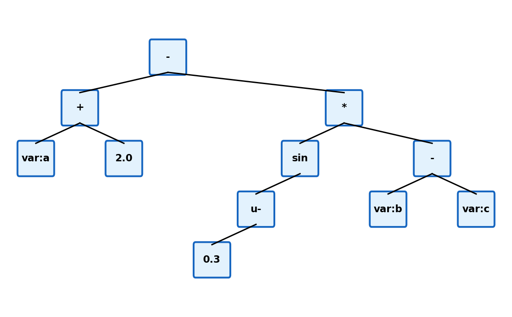

---

### Phase 2 — Step-by-step evaluation (leaves to root)

**Step 1:** Variable `a` is resolved to `1.0`.

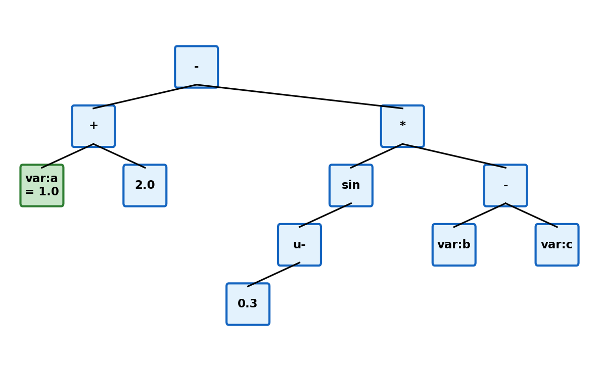

---

**Step 2:** Literal `2.0` is evaluated.

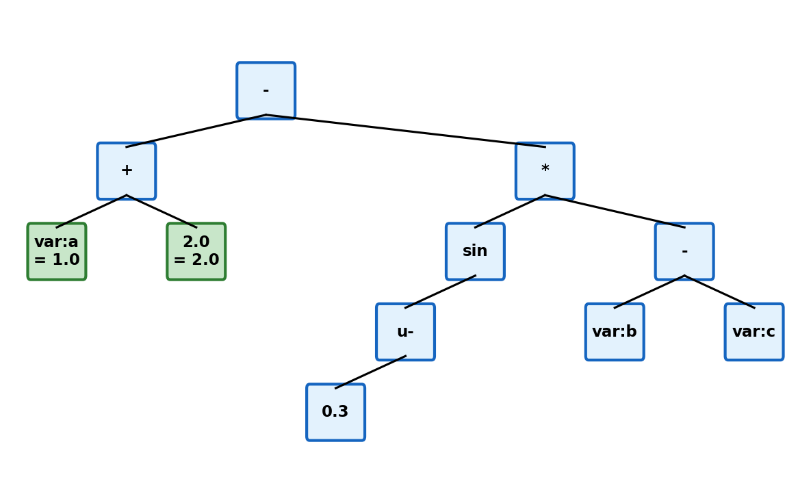

---

**Step 3:** Binary `+` computes `1.0 + 2.0 = 3.0`.

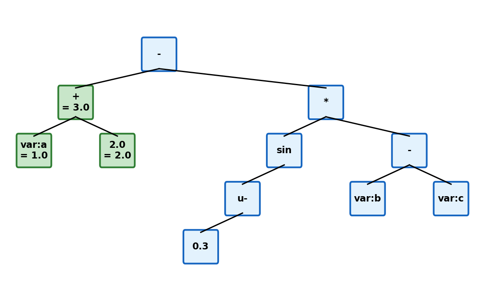

---

**Step 4:** Literal `0.3` is evaluated.

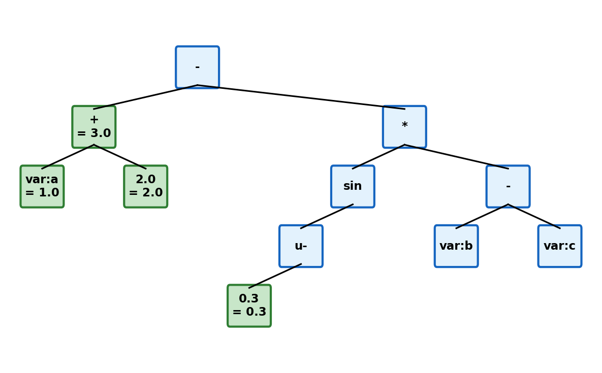

---

**Step 5:** Unary `-` computes `-0.3`.

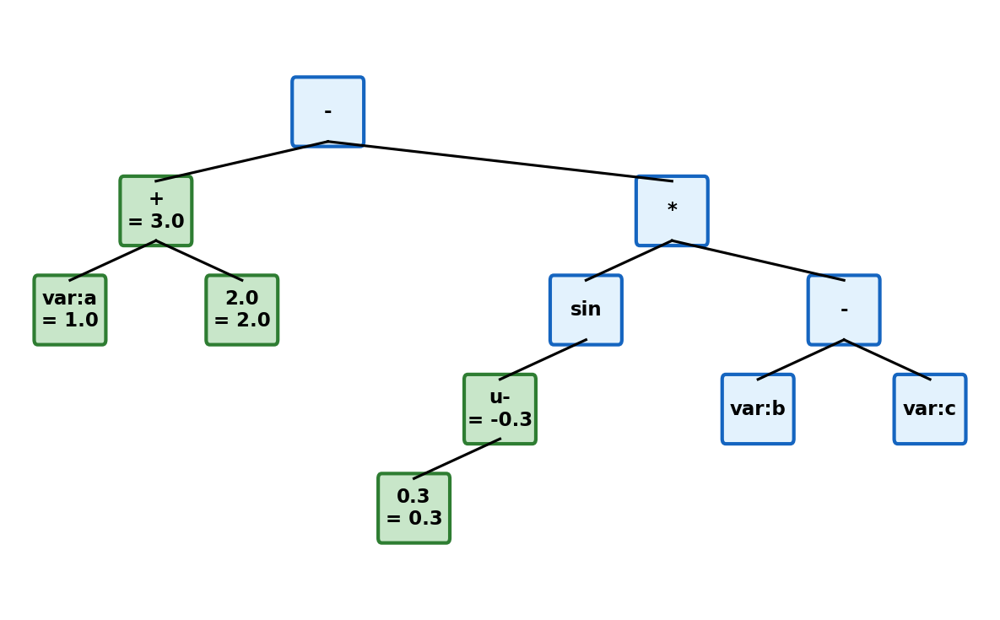

---

**Step 6:** Function `sin(-0.3)` returns `-0.2955...`.

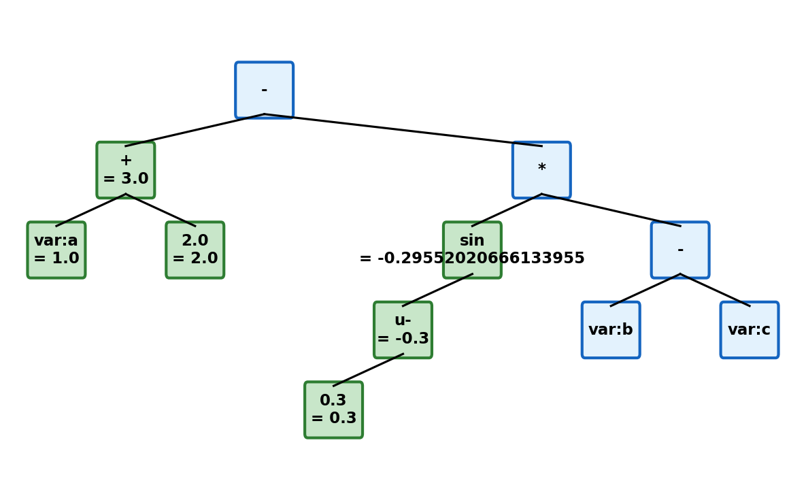

---

**Step 7:** Variable `b` is resolved to `2.0`.

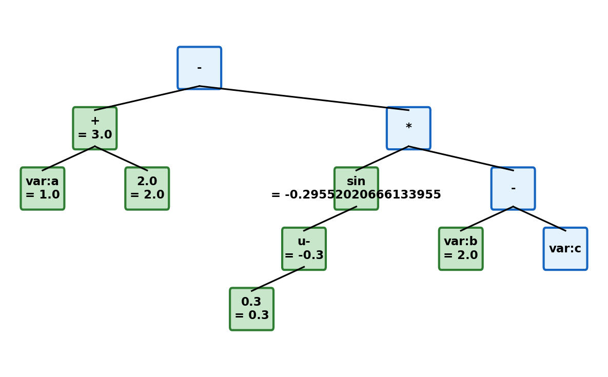

---

**Step 8:** Variable `c` is resolved to `0.5`.

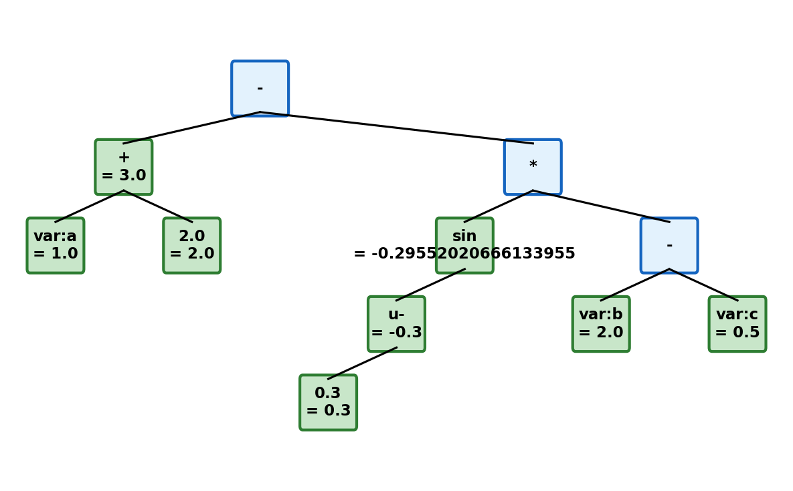

---

**Step 9:** Binary `-` computes `2.0 - 0.5 = 1.5`.

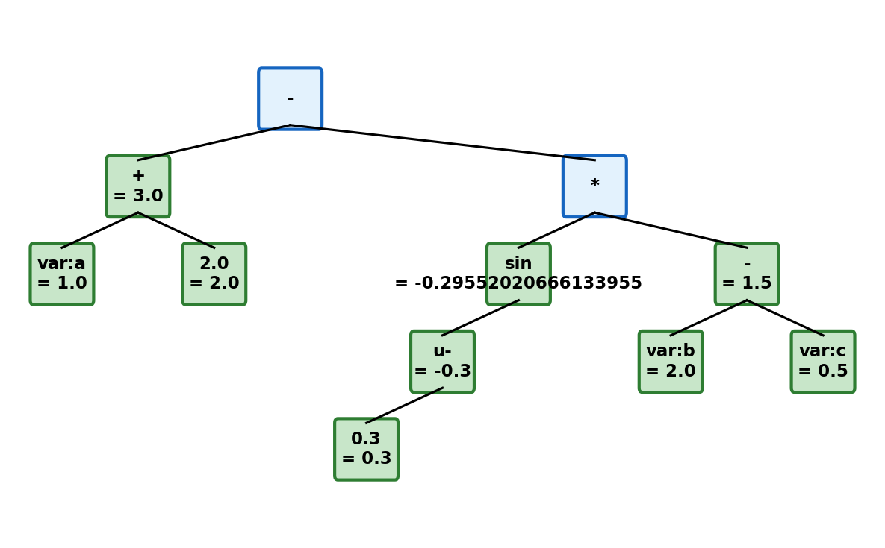

---

**Step 10:** Binary `*` computes `-0.2955... * 1.5 = -0.4432...`.

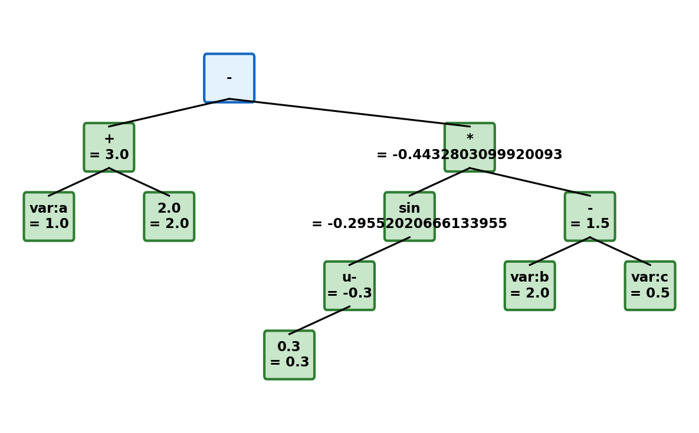

---

**Step 11:** Binary `-` computes `3.0 - (-0.4432...) = 3.4432...`
(final result).

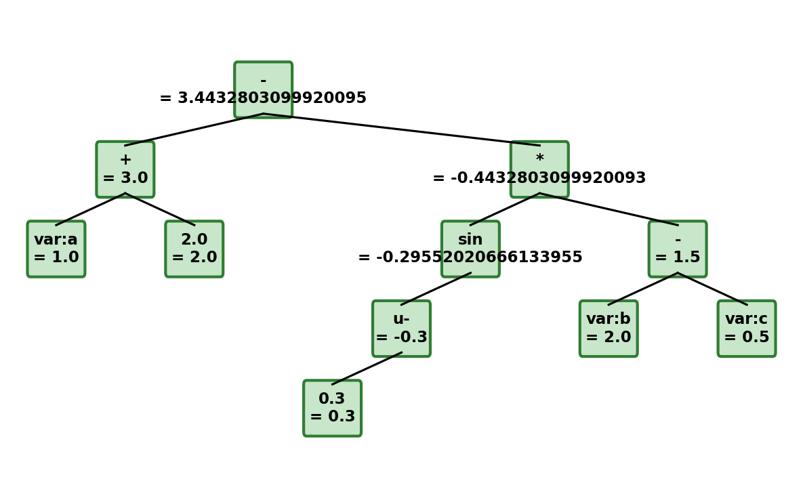
